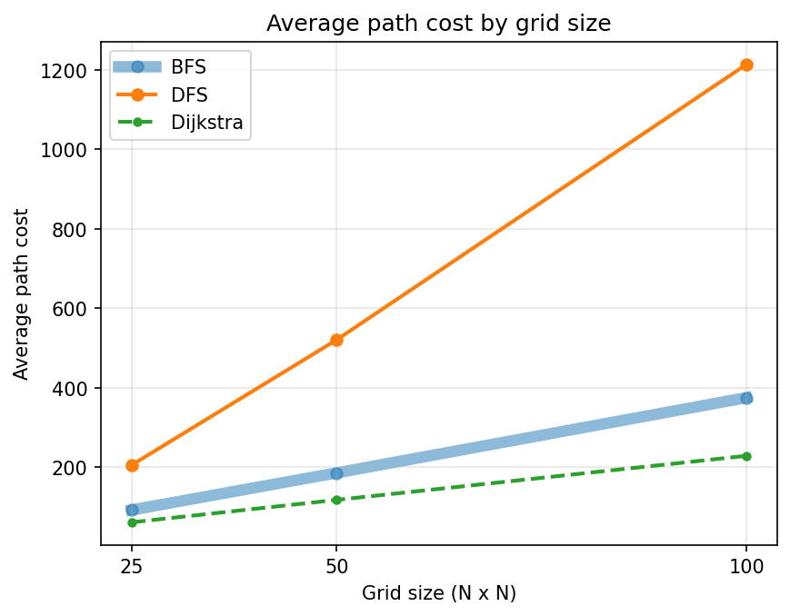
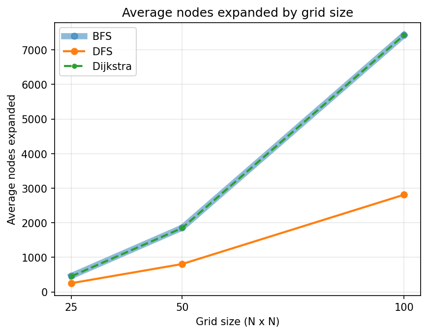
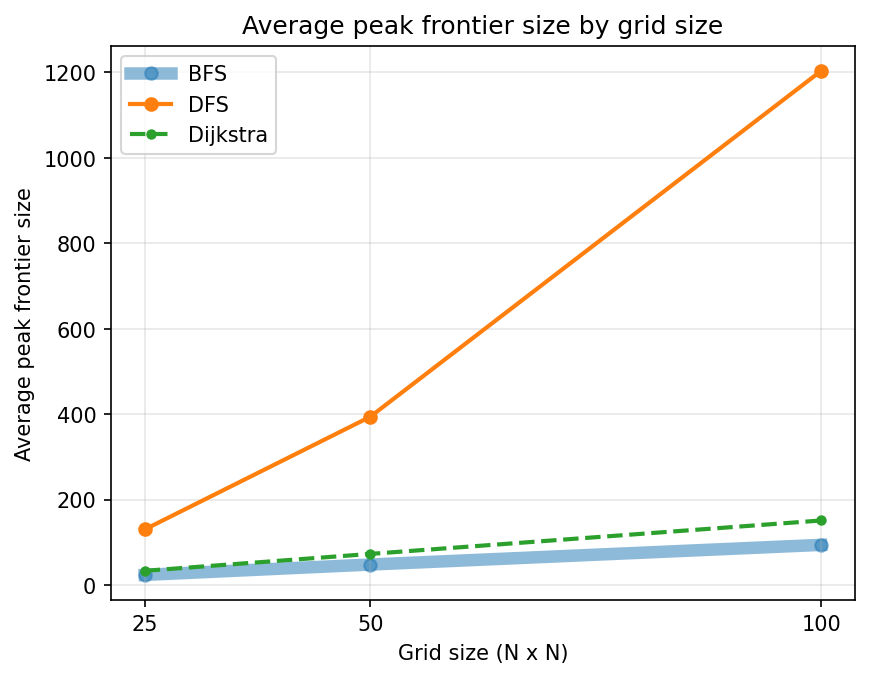

# Grid World Search

An interactive pathfinding visualizer and benchmark in Python and Pygame. Draw walls, scatter weighted terrain, run BFS, DFS or Dijkstra, and compare how each one performs through live metrics and a reproducible benchmark.


## Features

- **Three algorithms on one grid:** BFS, DFS and Dijkstra, each written as a plain function with the same return format
- **Weighted terrain:** cells cost 1 by default, or 2 to 9 when weighted, so shortest-by-steps and cheapest-by-cost can differ
- **Interactive editing:** draw and erase walls with the mouse, scatter random weights, clear the grid
- **Live stats panel:** nodes expanded, nodes generated, peak frontier size, path length, path cost, and run time
- **Headless benchmark:** runs every algorithm on hundreds of random grids and writes the results to CSV
- **Built-in correctness check:** every benchmark grid asserts that Dijkstra's path cost is never higher than BFS's or DFS's

## Run it

```
pip install pygame
python main.py
```

| Key        | Action                 |
| ---------- | ---------------------- |
| B          | Run BFS                |
| D          | Run DFS                |
| J          | Run Dijkstra           |
| G          | Scatter random weights |
| C          | Clear the grid         |
| Left-drag  | Draw walls             |
| Right-drag | Erase walls            |

The start (green) is fixed at the top-left and the goal (red) at the bottom-right. For the clearest comparison, press `G`, then run `B` and `J` on the same grid.

## Results

Benchmarked on random grids with 25% walls and 20% weighted cells (weights 2 to 9), seed 42, 200 trials per size. Unsolvable grids are skipped, so every algorithm sees the same grids. Sample sizes are 139 (25x25), 144 (50x50) and 134 (100x100) solvable grids.

|                           | 25x25     | 50x50     | 100x100   |
| ------------------------- | --------- | --------- | --------- |
| Dijkstra path cost vs BFS | 33% lower | 37% lower | 39% lower |
| DFS path cost vs BFS      | 2.2x      | 2.8x      | 3.2x      |
| DFS peak frontier vs BFS  | 5.5x      | 8.2x      | 12.8x     |



**Dijkstra finds cheaper paths, and the gap grows with grid size.** BFS minimizes the number of steps and ignores weights, so it happily walks through expensive cells. Longer paths have more chances to cross heavy terrain, which is why the gap widens.



**BFS and Dijkstra expand almost the same number of cells** (7,430 vs 7,424 at 100x100), so their lines overlap. The weights change which path wins, not how much of the grid gets explored. Dijkstra runs about 2x slower because heap operations cost more than a deque. DFS expands about 62% fewer cells at 100x100, but its paths are the worst of the three.



**DFS uses the most frontier memory.** This implementation marks cells visited when they are popped, which is true depth-first order, but it lets the same cell sit on the stack several times. On an open grid, that made its peak frontier about 13x BFS's at 100x100.

Absolute run times depend on the machine, so compare the ratios rather than the milliseconds.

## Design notes

- **Plain functions with a shared contract.** Every algorithm takes `(grid, start, goal)` and returns a dict with `found`, `parent_of`, `visit_order`, and the counters. The visualizer replays `visit_order`, and the benchmark reads the counters, so each algorithm is written once.
- **Goal check on pop, not push.** Dijkstra needs this to stay optimal, and using it everywhere keeps the expanded counts comparable.
- **Cell encoding:** `-1` is a wall, `1` is an empty cell, and `2` to `9` are weighted cells. Every walkable cell costs at least 1, which Dijkstra requires.
- **Reproducible benchmark.** All randomness goes through one seeded `random.Random`, so the same seed gives the same grids.

## Reproduce the results

```
python benchmark.py      # writes results.csv and prints the table
python make_charts.py    # writes cost.png, expanded.png and frontier.png
```

## Project layout

| File             | Contents                                                                        |
| ---------------- | ------------------------------------------------------------------------------- |
| `algorithms.py`  | Grid helpers, BFS, DFS, Dijkstra, path cost, random grid generation (no Pygame) |
| `main.py`        | Pygame app: drawing, input, side panel                                          |
| `benchmark.py`   | Headless benchmark and CSV export                                               |
| `make_charts.py` | Charts from `results.csv`                                                       |
| `test_basics.py` | Sanity checks for the algorithms and helpers                                    |

## Roadmap

- A\* with a Manhattan heuristic, added to the benchmark
- Maze generation (recursive backtracker)
- Speed control and a display of the frontier cells
